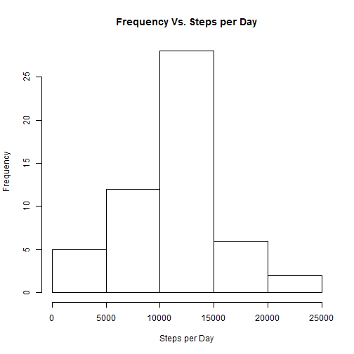
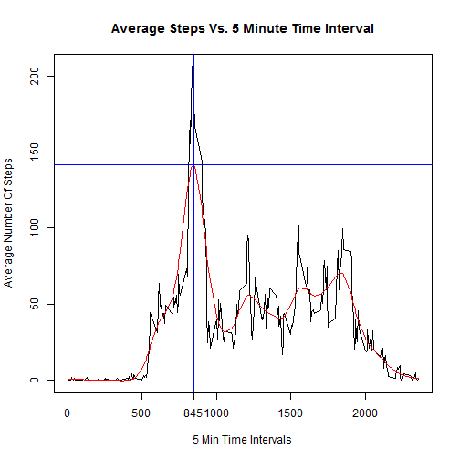
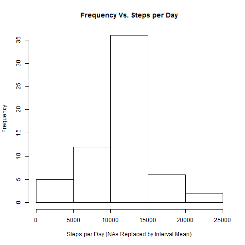
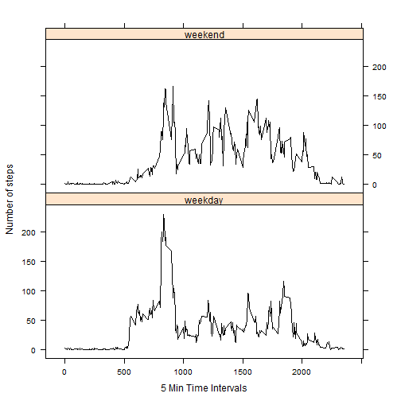

opts_chunk$set(echo=TRUE,cache=FALSE)


```r
library(dplyr)   # load the dplyr library 
library(lattice) # load the lattice library
```

## Loading and preprocessing the data

1. Show any code that is needed to

2. Load the data (i.e. read.csv())

3. Process/transform the data (if necessary) into a format suitable for your analysis


```r
sourcefilename<-"activity.zip"            # creates a variables with the source zip file name
unzip(sourcefilename,overwrite=TRUE)      # unzips the source file and overwrites the existing file if present
DF<-read.csv("activity.csv",header=TRUE,sep=",",na.string="NA")  # read in the data file
head(DF)
```

```
##   steps       date interval
## 1    NA 2012-10-01        0
## 2    NA 2012-10-01        5
## 3    NA 2012-10-01       10
## 4    NA 2012-10-01       15
## 5    NA 2012-10-01       20
## 6    NA 2012-10-01       25
```

## What is mean total number of steps taken per day?

For this part of the assignment, you can ignore the missing values in the dataset.

1. Calculate the total number of steps taken per day

2. If you do not understand the difference between a histogram and a barplot, research the difference between them. Make a histogram of the total number of steps taken each day

3. Calculate and report the mean and median of the total number of steps taken per day


```r
steps_per_day<-aggregate(steps ~ date,DF,FUN=sum,na.rm=TRUE)        # aggregate function to sum the steps by the dates groups
names(steps_per_day)[names(steps_per_day)=="steps"] <- "steps.sum"  # rename "steps"" column to "steps.sum"

# historgram of step per day
hist(steps_per_day$steps.sum,xlab="Steps per Day",main="Frequency Vs. Steps per Day")
```

 

```r
options(scipen=999)  # Force R not to use scientific notation
mean_steps <- round(mean(steps_per_day$steps.sum),digits=2)     # calculate the mean of total steps per day
median_steps <- round(median(steps_per_day$steps.sum),digits=2) # calculate the median of total steps per day
```

**The mean and median of the total number of Steps per Day:**  
Mean:   10766.19   
Median: 10765   


## What is the average daily activity pattern?

1. Make a time series plot (i.e. type = "l") of the 5-minute interval (x-axis) and the average number of steps taken, averaged across all days (y-axis)

2. Which 5-minute interval, on average across all the days in the dataset, contains the maximum number of steps?


```r
# calculate the mean of each 5 minute time interval
interval_mean<-aggregate(steps ~ interval,DF,FUN=mean,na.rm=TRUE)

# plot the mean values of each 5 minute time interval
plot(interval_mean$interval,interval_mean$steps,type="l",xlab="5 Min Time Intervals",ylab="Average Number Of Steps",
     main="Average Steps Vs. 5 Minute Time Interval")

# calculate the smooth average across all 5 minute step intervals
smooth_avg<-smooth.spline(interval_mean$interval,interval_mean$steps,df=20)  # calculate smoothing average across all intervals
max_avg_value    <- round(max(smooth_avg$y),digits=2)                         # determine the max average value
interval_max_avg <- smooth_avg$x[smooth_avg$y==max(smooth_avg$y)]             # determine the interval with max average value

# plot additional lines to provide evidence of proper calculations
lines(smooth_avg, col='red',type="l", pch=22, lty=1, lwd=1)   # plot smooth spline average of all 5 minute time intervals
abline(h=max_avg_value,b=0,col="blue")                        # draw the horizontal line
abline(v=interval_max_avg,b=0,col="blue")                     # draw the vertical line
axis(1,at=interval_max_avg)                                   # plot the x intersect value on the x axis
```

 

The maximum average number of steps accross all data points is 141.47 and is found at time interval 845.

## Imputing missing values

Note that there are a number of days/intervals where there are missing values (coded as NA). The presence of missing days may introduce bias into some calculations or summaries of the data.

1. Calculate and report the total number of missing values in the dataset (i.e. the total number of rows with NAs)

2. Devise a strategy for filling in all of the missing values in the dataset. The strategy does not need to be sophisticated. For example, you could use the mean/median for that day, or the mean for that 5-minute interval, etc.

3. Create a new dataset that is equal to the original dataset but with the missing data filled in.

4. Make a histogram of the total number of steps taken each day and Calculate and report the mean and median total number of steps taken per day. Do these values differ from the estimates from the first part of the assignment? What is the impact of imputing missing data on the estimates of the total daily number of steps?

**Description how imputing the NA values was performed:**

The method used to impute the missing "NA" values in the data set was to create a new column in the dataset called "steps.mean" and insert the mean value of the interval into this column for all data points (including the NA values) by the interval value.  The data frame was then parsed to identify which rows has "NA"" values and then replace that value with the mean interval value where necessary.  Once the replacement value was inserted the mean column was no longer needed and was then removed.


```r
total_na_count <- sum(is.na(DF$steps)) # calculate the total number of NAs in the data set

 # calculate the interval group means
DF_groups <- merge(DF,aggregate(steps ~ interval, data=DF,mean),by="interval",suffix=c("",".mean"))

# step the value to the mean where step value is NA
DF_groups <- DF_groups %>%  mutate(steps = ifelse(is.na(steps),steps.mean,steps))  

# remove the mean column
DF_groups <- DF_groups[,c(1,2,3)]  

steps_per_day2<-aggregate(steps ~ date,DF_groups,FUN=sum)               # aggregate function to sum the steps by the dates groups
names(steps_per_day2)[names(steps_per_day2)=="steps"] <- "steps.sum"    # rename "steps"" column to "steps.sum" 

# historgram of step per day
hist(steps_per_day2$steps.sum,xlab="Steps per Day (NAs Replaced by Interval Mean)",main="Frequency Vs. Steps per Day")
```

 

```r
mean_steps2 <- round(mean(steps_per_day2$steps.sum),digits=2)     # calculate the mean of total steps per day
median_steps2 <- round(median(steps_per_day2$steps.sum),digits=2) # calculate the median of total steps per day
```

**Total Number of NAs in the dataset:** 2304

**The mean and median of the total number of Steps per Day values (with the NAs removed):**  
Mean:   10766.19   
Median: 10766.19 

**Do these values differ from the estimates from the first part of the assignment?**

The mean values do not differ from the first part of the assignment, however the median values do as can be seen below.

**Mean**  
Before: 10766.19   
After : 10766.19    

**Median**   
Before: 10765   
After : 10766.19    
Difference: 1.19

**What is the impact of imputing missing data on the estimates of the total daily number of steps?**

The impact of imputing missing data on the estimates can have a significant effect on the final results.  This is a good example why it is important to closely document the data handling, processing and analysis steps so that it is clear what the person processing the data intended.


## Are there differences in activity patterns between weekdays and weekends?

For this part the weekdays() function may be of some help here. Use the dataset with the filled-in missing values for this part.

1. Create a new factor variable in the dataset with two levels – “weekday” and “weekend” indicating whether a given date is a weekday or weekend day.

2. Make a panel plot containing a time series plot (i.e. type = "l") of the 5-minute interval (x-axis) and the average number of steps taken, averaged across all weekday days or weekend days (y-axis). See the README file in the GitHub repository to see an example of what this plot should look like using simulated data.


```r
# create a factor column with the values of "weekend" or "weekday" based on the date in the row provided.
DF_groups$day_type <- factor(ifelse(weekdays(strptime(DF_groups$date,format="%Y-%m-%d"))=="Sunday" 
                                    | weekdays(strptime(DF_groups$date,format="%Y-%m-%d"))=="Saturday","weekend","weekday"))

# aggregate the mean steps per day for the weekday and weekends 
mean_steps_per_day_type <- aggregate(steps ~ interval + day_type, data = DF_groups, mean)

# plot a panel xyplot do display the mean steps per day for the weekday and weekends
xyplot(steps ~ interval | day_type, data=mean_steps_per_day_type, type = "l", layout = c(1, 2), 
       xlab = "5 Min Time Intervals", ylab = "Number of steps",col="black")
```

 

